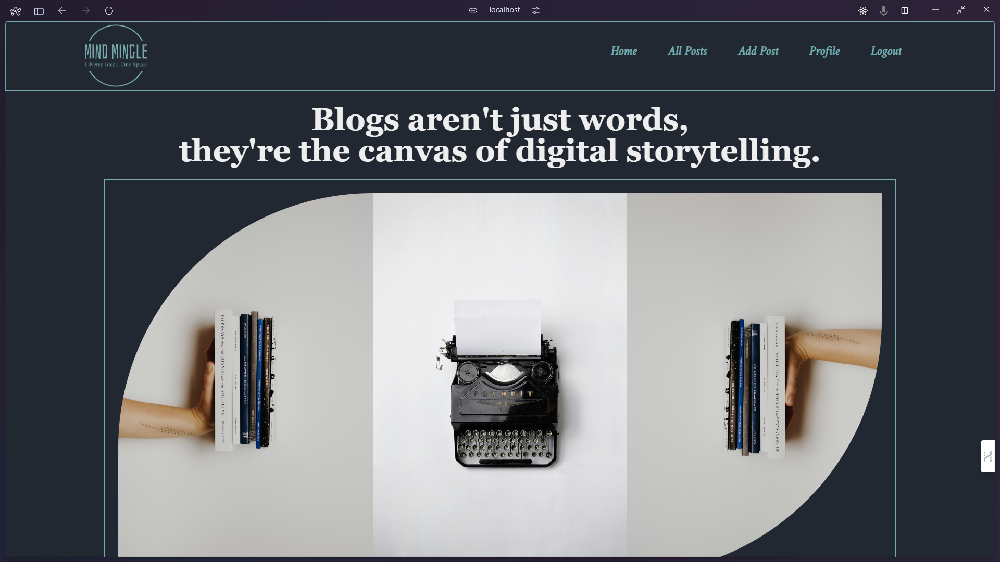
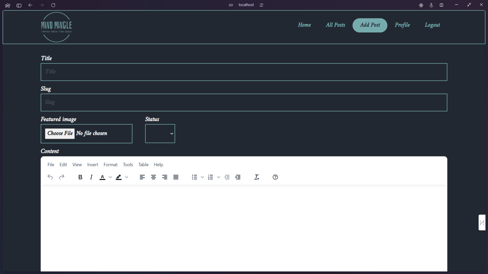
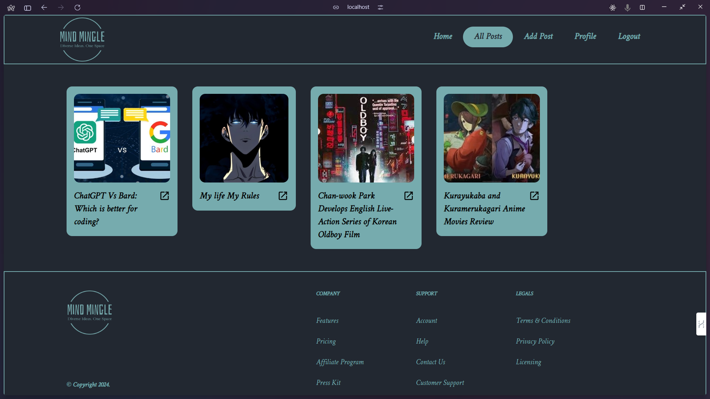
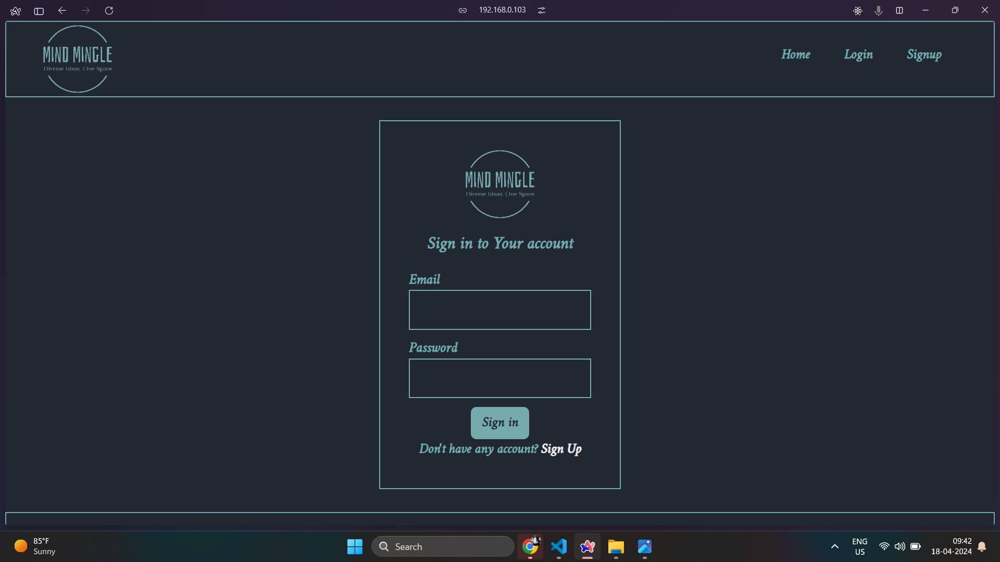
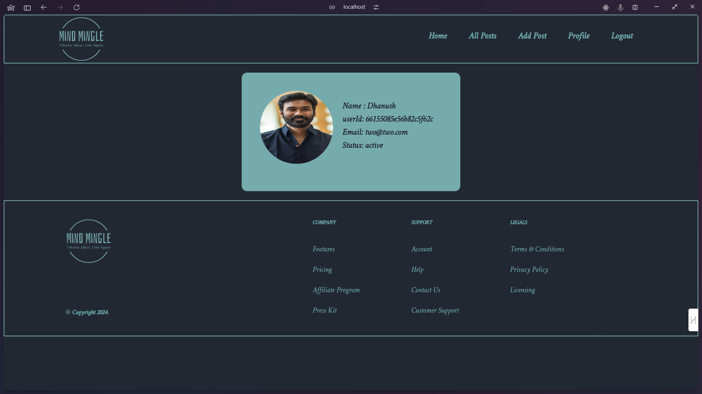

# Mind Mingle (A blog page)

Welcome to my project! Below you'll find an overview of the project structure, functionalities, and other important information.


## Features
- **Authentication**: 
  - Sign Up
  - Sign In
  - Logout
- **State Management**:
  - Redux
  - Context
- **Routing**:
  - CRUD operations
  - Text file handling
- **Database**:
  - File management

## Pages
- **Sign In Page**: For user authentication and login.
- **Sign Up Page**: For new user registration.
- **Home Page**: Landing page of the application.
- **Add Post Page**: Page to add new posts.
- **All Posts Page**: Displays all posts from the database.
- **Profile Page**: User profile page with user details and settings.

## Technologies
- React
- Redux
- Context API
- React Router
- Node.js
- Appwrite
- File handling libraries

## Installation

1. Clone the repository.
    ```
    git clone https://github.com/dhanushbd03/mind-mingle.git
    ```
2. Navigate to the project directory.
    ```
    cd mind-mingle
    ```
3. Install dependencies.
    ```
    npm install
    ```
4. Run the Project
   ```
   npm run dev
   ```
## Usage

1. Create your own `.env` file in the root directory of the project.

2. Add your appropriate details to the `.env` file. For example:

    ```
    
    VITE_APPWRITE_PROJECT_ID="*****************"
    VITE_APPWRITE_DATABASE_ID="*****************"
    VITE_APPWRITE_COLLECTION_ID="*****************"
    VITE_APPWRITE_BUCKET_ID="*****************"
    VITE_APPWRITE_USER_BUCKET_ID="*****************"
    VITE_APPWRITE_USER_PROFILE_COLLECTION_ID="*****************"
    ```

3. Make sure to replace `*****************` with your actual appwrite credientials or any other environment variables you want to use in your project.
## Images


- Home Page
  - 
  
- Add Post Page
  - 
  
- All Post Page
  - 
  
- Signin Page/Signup Page
  - 
  
- Profile Page
  - 

---


